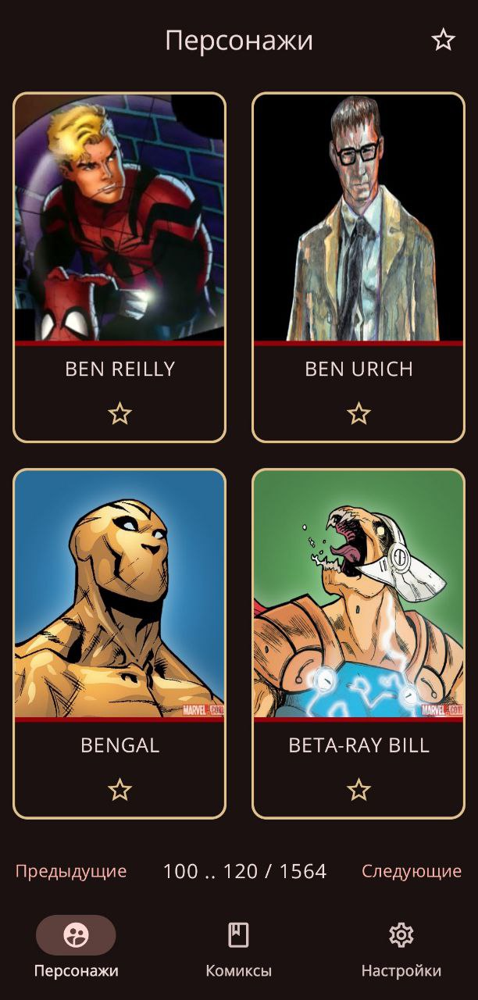
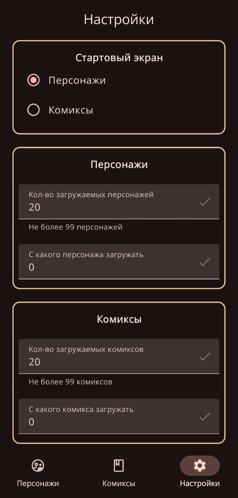
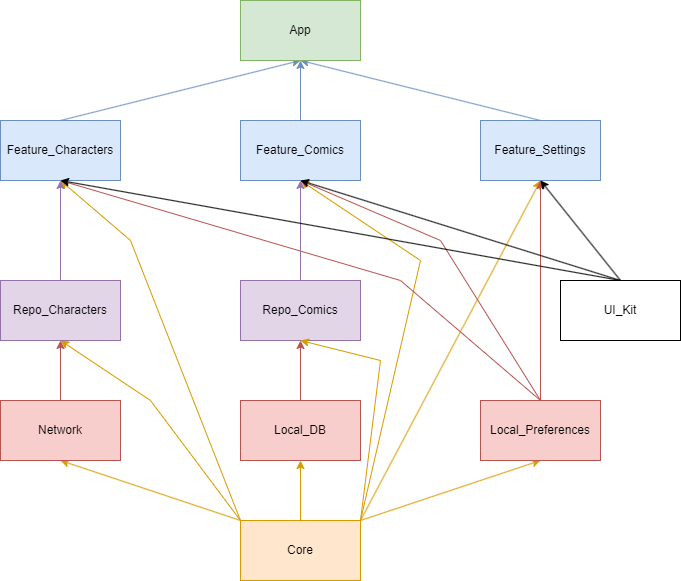

  
  
  <h3>Marvel</h3>
  <h5>Просмотр списка персонажей и комиксов marvel</h5>

# Скриншоты

  
  
  

# Возможности
- **Просмотр персонажей**.
- **Добавление и удаление персонажей из избранных**.
- **Просмотр комиксов**.
- **Добавление и удаление комиксов из избранных**.
- **Выбор стартового экрана**.
- **Регулировка кол-ва загружаемых персонажей и комиксов**.

# Стек технологий

- **Язык программирования Kotlin**.
- **Kotlin Symbol Processing API**.
- **Многомодульность**.
- **Single Activity Application паттерн**.
- **UI на Jetpack Compose**.
- **Для навигации используется Navigation Compose**.
- **Архитектура презентационного слоя MVVM (ViewModel + StateFlow)**.
- **Hilt в качестве DI для организации архитектуры приложения**.
- **Kotlin Coroutines для асинхронных операций**.
- **Retrofit + Gson для сетевого взаимодействия**.
- **Room для локальной базы данных**.
- **JUnit и Mockito для тестирования**.

# REST API
https://developer.marvel.com/docs

# Презентация
https://docs.google.com/presentation/d/1D_3fEmVQd_ftNcov_UpLu-sdA8UcAb6ePYc2qf8tYPM/edit?usp=sharing

# Связи между модулями

  

